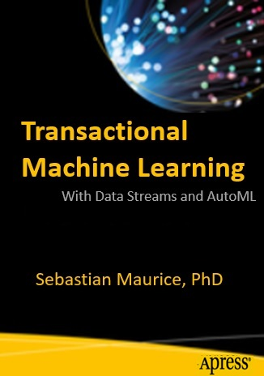

# Transactional Machine Learning with Data Streams and AutoML
### Author: Sebastian Maurice, PhD

#### Publisher: [Apress Publisher](https://www.apress.com/us)
##### Global Distributor: [Springer](https://www.springer.com/gp)
##### In Store Date: First Quarter 2021
#### [Read TML Blog On Confluent Website](https://www.confluent.io/blog/transactional-machine-learning-with-maads-viper-and-apache-kafka/?utm_source=linkedin&utm_medium=organicsocial&utm_campaign=tm.devx_ch.transactional-machine-learning-with-maads-viper-and-apache-kafka_content.analytics-)

<table>
<tr>
<th> Book Cover</th>
<th>Book Description</th>
</tr>
<tr>
<td width=300  valign="top" style="vertical-align:top">

</td>
<td>

**_Fast data, requires fast machine learning_**.  Understand how to apply auto machine learning to data streams and create transactional machine learning (TML) solutions that are frictionless (require minimal to no human intervention) and elastic (machine learning solutions that can scale up or down by controlling the number of data streams, algorithms, and users of the insights).  *This book will strengthen your knowledge of the inner workings of TML solutions using data streams with auto machine learning integrated with Apache Kafka.*  You will be at the forefront of an exciting area of machine learning that is focused on speed of data and algorithm creation, scale, and automation.

**_Transactional Machine Learning with Data Streams and AutoML introduces the topic of applying auto machine learning to data streams to create solutions that are frictionless and elastic._**  From here, you will learn the principles of TML solutions and how these principles are used to build TML solutions.   Dr. Sebastian Maurice explains the technologies that make up a TML solution.  You will learn the industry challenges with applying machine learning to data streams.   You will learn the framework that will help you in choosing business problems that are best suited for TML.  You will also learn how to measure the business value of TML solutions.  You will then learn the technical components of TML solutions, including the reference and technical architecture of a TML solution.  This book also presents a TML solution template, that will make it easy for you to quickly start building your own TML solutions.  Specifically, readers are given access to a TML python library and integration technologies for download.  You will also learn how TML will evolve in the future, and the growing need by organizations for deeper insights from data streams.

By the end of the book, you will have a solid understanding of TML.  You will know how to build TML solutions with all the necessary details, and all the resources at your fingertips.   **_You will be at the technical and business forefronts, in the knowledge economy, where data creation speeds are increasing, requiring fast machine learning solutions that are frictionless and elastic that can create enormous business value, fast!_** 
</td>
</tr>
</table>
